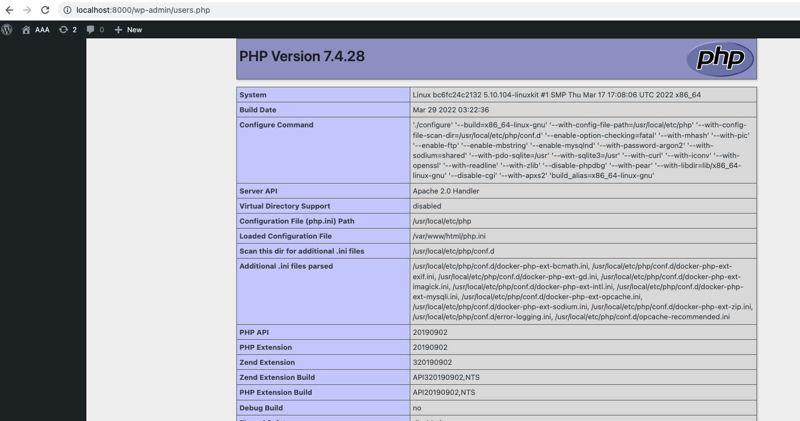

# CVE-2022-1329-WordPress-Elementor-RCE

该POC主要是基于[AkuCyberSec]((https://github.com/AkuCyberSec/CVE-2022-1329-WordPress-Elementor-3.6.0-3.6.1-3.6.2-Remote-Code-Execution-Exploit))的研究版本，并进行了一些补充。

# 使用说明

使用`docker-compose`开启漏洞环境：

```shell
docker-compose up -d
```

然后可以在浏览器访问WordPress的管理页面`http://localhost:8000/wp-admin`，创建admin用户，然后在**User**标签下创建一个其他用户，举个例子如下：

| 用户名 | 密码   | 角色   |
|--------|--------|--------|
| wc     | 123456 | Admin  |
| a2     | aaaaaa | Editor |

使用admin帐号登录，在**插件**标签下安装3.6.1版本的**Elementor**，zip包已在仓库中提供。

**重要** ：需要修改WP的默认上传限制，在网站根目录下写入`php.ini`文件：

```text
upload_max_filesize = 64M
max_execution_time = 0
post_max_size = 150M
file_uploads = on
```

`docker restart xxxx`重启服务后，可以使用POC脚本进行漏洞验证，注意修改脚本中的用户名密码为**非admin用户**的信息：

```shell
python3 poc.py
```

**注意：**脚本的运行结果可能返回`upload problem`，但其实脚本运行是成功的，可以刷新浏览器，看到恶意代码的执行结果。

目前植入的恶意脚本只有`phpinfo();`一句话，可以使用以下步骤进行编辑，**不过在重新运行漏洞脚本之前，需要到docker容器里面手动删除已安装的elementor-pro插件**，路径应该是`/var/www/html/wp-content/plugin/elementor-pro`。

```shell
# 解开压缩包
unzip elementor-pro.zip

# 修改植入代码，目前放在了文件的最上边
nano elementor-pro/elementor-pro.php

# 重新打包
rm elementor-pro.zip; zip -ry elementor-pro.zip elementor-pro

# 运行漏洞验证
python3 poc.py
```


